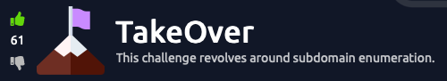

# TryHackMe- TakeOver-Walkthrough

<p align="center">
  
</p>


## Room Information

| Category   | Value                                |
| ---------- | ------------------------------------ |
| Platform   | TryHackMe                            |
| Room       | TakeOver                             |
| Difficulty | Easy                                 |
| Type       | Web Enumeration / Subdomain Takeover |

---

Note : I did the challenge/room with the attackbox and labmachine provided by the tryhackme platform not with my linux virtualmachine or any other vm.


## Objective

In this room, FutureVera, a space research company, believes one of its subdomains may be vulnerable. The goal is to identify the vulnerable subdomain and understand how a subdomain takeover can occur.

---

## Skills I Learned

* Editing the hosts file
* Basic web enumeration
* Using Nmap for scanning
* Analyzing SSL certificates
* Discovering hidden subdomains
* Understanding Subdomain Takeovers
* Investigating cloud service misconfigurations

---

# Step 1 - Configure the Target Domain

Before visiting the website, I added the target machine IP address to my hosts file.

```bash
sudo nano /etc/hosts
```

Added:

```text
<MACHINE_IP> futurevera.thm (machine ip will be provided by tryhackme when you click on start lab.)
```

Then I verified connectivity.

```bash
ping futurevera.thm
```

---

# Step 2 - Initial Enumeration

I started with a basic Nmap scan to identify the services running on the target.

```bash
nmap futurevera.thm -oN nmapResults.txt
```

### Results

```text
22/tcp  open  ssh
80/tcp  open  http
443/tcp open  https
```

The scan revealed SSH on port 22 and web services running on ports 80 and 443.

---

# Step 3 - Website Analysis

Next, I visited the website.

```text
https://futurevera.thm
```

The site appeared to be a standard company website. After reviewing the visible content and page source, I did not find any useful information.

---

# Step 4 - Checking the Support Service

The room description mentioned that the company was rebuilding its support platform. This suggested that a support-related subdomain might exist.

I added it to my hosts file:

```text
<MACHINE_IP> support.futurevera.thm
```

Then I visited:

```text
https://support.futurevera.thm
```

---

# Step 5 - Looking at the SSL Certificate

While investigating the support subdomain, I examined the SSL certificate details.

The certificate contained additional Subject Alternative Names (SANs), which revealed another hidden subdomain.

This is a useful enumeration technique because SSL certificates can sometimes expose hostnames that are not easily discoverable through other methods.

---

# Step 6 - Finding the Hidden Subdomain

After discovering the hidden hostname, I added it to my hosts file.

```text
<MACHINE_IP> <hidden-subdomain/dns name>.support.futurevera.thm
```

When I visited the host, it redirected me to an Amazon S3 endpoint.

---

# Step 7 - Finding the Takeover Opportunity

The Amazon S3 page displayed an error indicating that the resource no longer existed.

The flag was visible in the redirected URL.

---

# What is a Subdomain Takeover?

A Subdomain Takeover occurs when:

1. A DNS record points to a third-party service.
2. The associated service or resource is deleted.
3. The DNS record remains active.
4. An attacker registers or claims the abandoned resource.

As a result, the attacker can gain control of the affected subdomain.

---

# What I Learned

This room demonstrated the importance of thorough enumeration.

Key takeaways include:

* Enumeration can reveal hidden attack surfaces.
* SSL certificates can expose valuable information such as subdomains.
* Unused DNS records should be removed promptly.
* Cloud services must be decommissioned carefully.
* Subdomain Takeovers remain a common security risk.

---

---

## Author

**Alan Pradeep**

GitHub: https://github.com/

TryHackMe: https://tryhackme.com/p/XploitNomad
